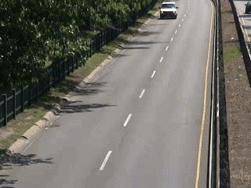
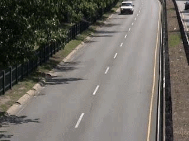

# Real-time Movement Filter

A [GStreamer](https://gstreamer.freedesktop.org/) plugin that detects motion in a video and highlights moving objects **in red**. The computation is parallelized with **CUDA** so it can run in real time, and a plain C++ version is provided for comparison.

The filter is exposed to GStreamer as the element `cudafilter`, so it can be plugged into any pipeline: video file, webcam, or live display.

# Results




## Requirements

- Linux
- An NVIDIA GPU with up-to-date drivers (for the CUDA version)
- [Nix](https://nixos.org/) with flakes enabled, which provides all the dependencies below. Without Nix, install them yourself.

| Dependency | Purpose |
| --- | --- |
| `gcc`, `cmake`, `ninja`, `make`, `pkg-config` | Build tools |
| CUDA toolkit (`nvcc`, `cudart`) | GPU version of the filter |
| GStreamer + plugins (base, good, bad, ugly) | Video pipeline |
| `libpng`, `zlib`, `tbb` | Image and parallelism libraries |
| Google Benchmark | Benchmarks |

## Building

Enter the development environment from the project root (the `flake.nix` sets up the compilers, the CUDA paths and `LD_LIBRARY_PATH`):

```sh
nix develop
```

Then build the project:

```sh
cmake -S . -B build --preset release -D USE_CUDA=ON
cmake --build build
```

Use `--preset debug` instead of `release` for a debug build. The plugin libraries are generated in `./build`.

## Usage

Run these steps from the project root, with a video named `data/video03.avi` in the current folder.

### 1. Register the plugin

```sh
export GST_PLUGIN_PATH=$(pwd)
# ln -sf ./build/libgstcudafilter-cpp.so libgstcudafilter.so <-- Used for the CPU version (slower)
ln -sf ./build/libgstcudafilter-cu.so libgstcudafilter.so # <-- Used for the GPU-Optimized version
```

Check that GStreamer sees it:

```sh
gst-inspect-1.0 cudafilter
```

### 2. Process a video and save the result

```sh
gst-launch-1.0 uridecodebin uri=file://$(pwd)/data/video03.avi \
  ! videoconvert ! "video/x-raw, format=(string)RGB" \
  ! cudafilter \
  ! videoconvert ! "video/x-raw, format=I420" \
  ! x264enc ! mp4mux ! filesink location=output.mp4
```

The filtered video is written to `output.mp4`.

### 3. Display the result live

From a video file, showing the FPS:

```sh
gst-launch-1.0 -e -v uridecodebin uri=file://$(pwd)/data/video03.avi \
  ! videoconvert ! "video/x-raw, format=(string)RGB" \
  ! cudafilter \
  ! videoconvert ! fpsdisplaysink
```

From a webcam:

A provided `main` executable is available in the `build` directory. Simply run:
```sh
./build/main
```

And the webcam should appear

### 4. Benchmark the filter

Run the pipeline as fast as possible without displaying anything, and read the FPS in the console output:

```sh
gst-launch-1.0 -e -v uridecodebin uri=file://$(pwd)/data/video03.avi \
  ! videoconvert ! "video/x-raw, format=(string)RGB" \
  ! cudafilter \
  ! videoconvert ! fpsdisplaysink video-sink=fakesink sync=false
```

Run it once with the C++ plugin and once with the CUDA plugin to compare their speed.

## How it works

The filter assumes a **fixed camera** and works in five steps, applied to every frame by both the C++ and CUDA versions:

1. **Background model.** Each pixel keeps `K` "reservoirs", which are candidate background colors with a weight. A new pixel value that is close enough to a reservoir (within a per-channel threshold) is averaged into it and increases its weight. Otherwise it may replace the lightest reservoir, with a probability that depends on the weights. The background color of a pixel is the color of its heaviest reservoir.
2. **Difference.** The mean absolute difference between the current frame and the background, over the R, G and B channels, gives a motion mask from 0 to 255.
3. **Noise suppression.** A morphological opening (erosion, then dilation) removes small isolated specks.
4. **Hysteresis thresholding.** Pixels above a high threshold are strong motion seeds. They grow into connected neighbors (8-connectivity) that are above a low threshold. This keeps whole moving objects and drops weak, isolated noise.
5. **Red overlay.** The final mask is added to the red channel of the frame, so moving objects appear in red.

## CUDA optimizations

The CUDA version (`filter_impl.cu`) produces the same result as the C++ one, but is optimized in several ways:

- **Parallelization.** Every per-pixel step (background update, difference, thresholding, morphology, red overlay) runs as a GPU kernel with one thread per pixel, using 32x32 thread blocks.
- **Allocate once.** The persistent state (background, reservoirs, masks, hysteresis buffers) is allocated on the GPU during the first frame and reused for the whole video, instead of being reallocated per frame.
- **Separable morphology.** Erosion and dilation are split into a horizontal pass and a vertical pass. With a window radius `r`, this costs about `2(2r+1)` reads per pixel instead of `(2r+1)^2`.
- **Tiled reconstruction.** The hysteresis step is the hardest to parallelize, because strong pixels propagate across the image. The kernel `reconstruction_tiled` loads a 32x32 tile and its 1-pixel border (halo) into **shared memory**, then propagates inside the tile until nothing changes. A global flag tells the host whether any tile changed, and the kernel is relaunched until the whole image converges. This replaces one slow global-memory pass per propagation step with many fast steps in shared memory per launch. A simpler global-memory version (`reconstruction`) is still in the file for reference.
- **Pitched memory.** Frames are copied with `cudaMallocPitch` and `cudaMemcpy2D`, which handles row strides correctly and keeps rows aligned.
- **Device-side random numbers.** The weighted reservoir replacement uses a small deterministic `xorshift32` generator seeded per pixel and per frame, since `rand()` is not available in kernels.

The C++ version (`filter_impl.cpp`) is the sequential reference. It uses plain loops, a stack-based flood fill for hysteresis, and 2D window erosion and dilation.

## Tuning and limitations

Several parameters are **hardcoded** at the top of `filter_impl.cu` and `filter_impl.cpp`. They were chosen by hand on our test videos, so the filter works better on some videos than on others. Change them in both files, then rebuild.

| Constant | Value | Role |
| --- | --- | --- |
| `K` | 5 | Reservoirs (candidate background colors) per pixel |
| `RGB_DIFF_THRESHOLD` | 30 | Max per-channel difference for a pixel to match a reservoir |
| `MAX_WEIGHTS` | 1000 | Cap on a reservoir's weight, which sets how stable the background is |
| `HYSTERESIS_LOW` | 15 | Minimum motion value for a pixel to be kept when connected to a strong one |
| `HYSTERESIS_HIGH` | 50 | Minimum motion value for a pixel to start a moving region |
| `OPENING_SIZE` | 2 | Radius of the noise-removal window (5x5) |
| `MAX_PASSES` | 100 | Number of frames after which the background stops being updated |
| `SPACES` | 8 | The background is updated once every `SPACES` frames |

What this means in practice:

- **Fixed camera only.** Any camera movement is detected as motion everywhere.
- **The background is learned from the first frames, then frozen.** After `MAX_PASSES` frames it is no longer updated, so the scene should be still (no moving objects) at the start of the video or webcam stream. Lighting changes later in the video will show up as motion.
- **Noise and contrast matter.** Noisy footage may need higher hysteresis thresholds, while low-contrast footage (moving objects close to the background color) may need lower ones.
- **Constant resolution.** Buffers are sized from the first frame, so the video size must not change while running.

## Code

The filter logic lives in two files, and the constants above are defined at the top of each:

- `filter_impl.cu`: CUDA implementation
- `filter_impl.cpp`: C++ implementation

## Troubleshooting

- **`No such element or plugin 'cudafilter'`:** check that `GST_PLUGIN_PATH` is exported in the current shell and that the `libgstcudafilter.so` symlink points to an existing file.
- **CUDA errors at runtime:** make sure the NVIDIA driver is installed. On NixOS, the flake expects the driver libraries in `/run/opengl-driver/lib`.
- **Remove the symlink to start over:** `rm libgstcudafilter.so`.